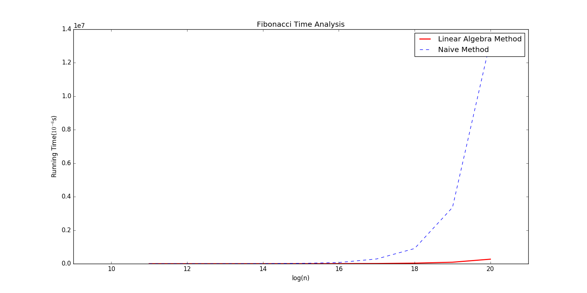
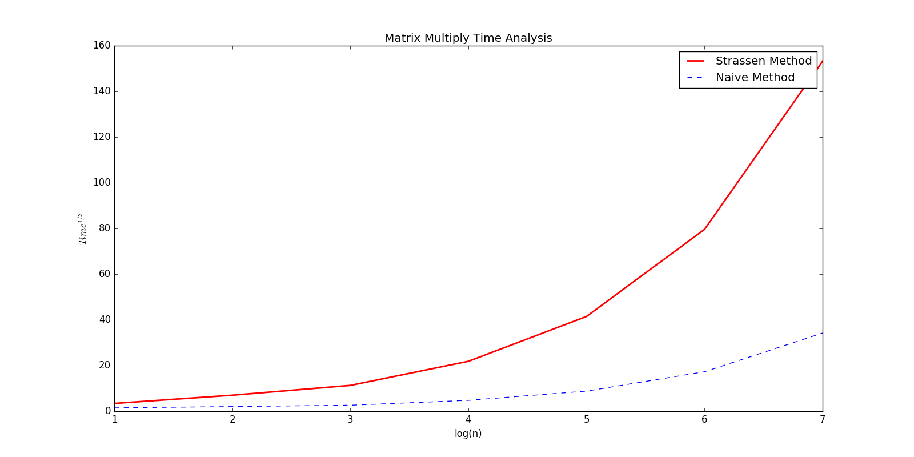
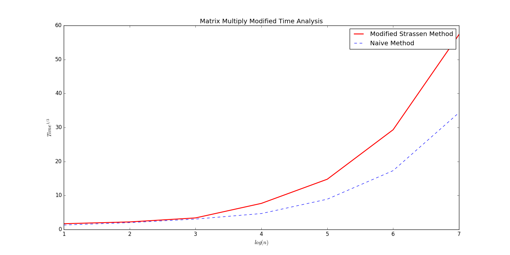

# 实验二：分治法——实验报告

### 陈潇涵 PB13000689 少年班学院

## 实验目的

通过实现二分查找和 Fibonacci 数的分治算法以及矩阵乘法中的 Strassen Algorithm，初步理解分治法的原理并利用它来解决一些经典问题。

## 实验原理

### 一般思路：

1. 分解：将问题分解为规模较小的两个子问题。（一般来说分解成尽可能相等的两个部分效果更好）
2. 分治：对分解得到的两个子问题再用分治法求解。
3. 合并：将已经得到的两个子问题的结果进行合并。

### 二分查找原理：

1. 分解：将 $x$ 与数组的中间元素比较大小。
2. 分治：递归地在一个数组中查找 $x$ 。
3. 合并：合并是平凡的，无需合并。

### Fibonacci数的分治算法原理：

Fibonacci 数的分治算法原理建立在如下观察的基础上：
$$
\begin{equation}
    \begin{pmatrix}
    f_{n+1} & f_n \\\
    f_n & f_{n-1}
    \end{pmatrix}
    =
    \begin{pmatrix}
    1 & 1 \\\
    1 & 0
    \end{pmatrix}
    ^{n}
\end{equation}
$$

因此，我们对上式右侧的矩阵的幂次用分治法进行计算，然后将所得结果矩阵的$(1,1)$处的元素取出即得到了我们所需的结果。

使用分治法计算矩阵幂次的方法如下（设上述的常矩阵为 $a$）：

1. 分解：若 $n$ 是 $2$ 的倍数，那么将幂次分解为 $a^n = a^{n/2} * a^{n/2}$，否则将其分解为 $a^n = a^{\lfloor{n/2}\rfloor} * a^{\lfloor{n/2}\rfloor} * a$。
2. 分治：计算 $a^{n/2}$ 的值。
3. 合并：按照分解中的分解方式计算乘积。

### 矩阵乘法的 Strassen Algorithm 

矩阵乘法的 Strassen Algorithm 运用分治法，将原来 $n * n$ 的矩阵乘法分解为 7 次 $\frac{n}{2} * \frac{n}{2}$ 规模的矩阵乘法和若干次矩阵加法和矩阵减法。如此进行分解后，利用主方法可以很快地得出结论， Strassen Algorithm 的时间渐进复杂度为 $O(n^{2.81})$，要优于朴素的矩阵乘法 $\Theta(n^3)$ 的时间复杂度。

由于 Strassen Algorithm 的公式比较复杂，就不再这里赘述。

## 实验内容

### 二分查找

二分查找法关键部分主要是处理目标元素有重复的时候。这部分代码如下：（代码比较丑，辛苦助教了！）


如果查找到了目标元素，那么就在 $source[0,...,k-1]$ 里查找目标元素，每次查找时，如果查找到，就把新得到的下表 $k_new$ 赋值给 $k$，然后将搜索范围限制到前面一半，即 $source[0,...,\frac{k-1}{2}]$，如此重复下去，直到在某次搜索中找不到目标元素，那么上一次的 $k$ 即是目标元素第一次出现的位置的下标。

### Fibonacci 数

主调函数调用如下函数：


该函数比较简单，思路很清晰，若 $n$ 是 $2$ 的倍数，那么将幂分解为 $matrix^n = matrix^{n/2} * matrix^{n/2}$，否则将其分解为 $matrix^n = matrix^{\lfloor{n/2}\rfloor} * matrix^{\lfloor{n/2}\rfloor} * matrix$。

### Strassen Algorithm

Strassen Algorithm 的实现也比较简单，只需要跟着算法的描述一步步计算即可。主要代码如下：


值得注意的是处理规模不是 2 的幂次的矩阵时处理方法：将矩阵扩充成下一个 2 的幂次的大小，多出的位置用 0 填充。然后用 Strassen Algorithm 计算结果，最后将计算结果中所需要的部分取出即得到了最后的结果。这样处理的好处是可以将 Strassen Algorithm 用于一般的矩阵乘法上，即非方阵的乘法。


## 实验中出现的问题

### 二分查找法

二分查找法试验中出现了一个比较大的问题，那就是在处理有多个相同元素的情况时，我是用的循环一个一个往前找，后来经助教指出来这里是有问题的。因为如果有大量的相同元素，那么我这样做就失去了二分查找法的优势，时间复杂度会变为$O(n)$。

这里正确的做法是改变二分查找法的查找范围，变为从数组开头到上一次找到的位置之前，如此反复查找，直到找不到所要找的元素，那么上一次确定的位置即是数组中第一次出现所要查找元素的位置。

### Fibonacci

Fibonacci 数试验中，我一开始写的是下面这样的
```python
return naive_matrix_multiple(matrix_pow(matrix, n / 2), matrix_pow(matrix, n / 2))
```

这样写的问题很明显，虽然用到了分治法，但是这样的递归式是 $T(n) = 2T(\frac{n}{2}) + O(1)$，这样的时间复杂度仍然是 $O(n)$，而且还多出了很多递归调用付出的代价，因此速度比朴素的 Fibonacci 数的算法还要慢很多很多。后来发现了该问题并修改成如下所示：


### Strassen Algorithm

Strassen Algorithm 的实现过程没有什么特别大的问题，因为它的实现方法定义得非常清晰。唯一的问题就在于运行时间很长，比朴素算法还要长很多。这个问题我们在实验分析里再详细探讨。

## 实验结果

实验结果均正常，并由助教检查过。我们把主要的精力放在实验结果分析上。

## 实验分析

### 二分查找

二分查找法我并没有重点考察，感觉没有什么特别的地方需要考察。

### Fibonacci 数

我们来分析一下 Fibonacci 数的线性代数方法和朴素方法的时间分析。根据递归式和主方法，我们很容易的知道线性代数的递归式和时间复杂度为 $T(n) = 2T(\frac{n}{2}) + O(1)$ 和 $\Theta(\log{n})$。而朴素方法的时间复杂度为 $\Theta(n)$。于是我令 $ k={11,12,...,20}, n=2^k$，测量用两种方法计算的 $n$ 个 Fibonacci 数所用的时间。并作出了如下 $RunningTime-\log{n}$ 关系图，注意图中纵坐标的值是扩大了 $10^6$ 后的结果。



从图中可以清晰的看到，随着 $n$ 的增大，朴素算法的计算时间显著增加，而线性代数算法的计算时间增加相对十分。$\log{n}=20$ 时，朴素算法的计算时间已经是线性代数算法计算时间的数十倍。这一时间走向和我们通过计算得到的渐进时间的走向是一致的。可见线性代数算法比朴素算法要优越许多。

### Strassen Algorithm

根据实验原理中的分析，我们已经知道 Strassen Algorithm 的时间复杂度为 $O(n^{2.81})$。为了探究 Strassen Algorithm 的实际效果，我们仿照 Fibonacci 数中的画图方法，观察 Strassen Algorithm 和朴素算法的计算时间比较。如下图是 $Time^{\frac{1}{3}}-\log(n)$ 关系图：



出乎意料的是，Strassen Algorithm 所花费的时间竟然是朴素算法的几十倍！那我们写这样一个算法的目的是什么？！为了搞清楚这个问题，我上网搜了一些资料，然后对算法研究了一下。发现，当问题规模较小时，朴素算法算得很快。然而 Strassen Algorithm 却需要花去大量时间对问题进行分割，其中有大量的复制操作，以及递归调用时也会有相当的开销。因此，若问题规模不大，Strassen Algorithm VS 朴素算法占不了任何便宜。后来又在网上看到，为了一定程度上规避这个问题，一般在实现 Strassen Algorithm 时，当问题规模小于一定数量时（比如 8 ），程序直接调用朴素算法算出结果。我沿着这个思路对算法进行了改进，并得到了如下结果：



通过比较这两张图的纵坐标（图形看上去形状差不多）我们可以发现，改进后的 Strassen Algorithm 的速度提高了将近 10 倍！

我认为，鉴于 Strassen Algorithm 中进行了大量的时间复杂度为 $\Theta(n^2)$ 的复制操作，以及它所造成的递归调用的开销，而且它和朴素算法时间复杂度的阶数本来差的就不多，只有在 $n$ 相当大的时候 Strassen Algorithm 才能体现它的优势。然而无奈我用的 Python，运算速度较之 C 相对慢得多，当阶数高的时候，运算时间已经无法忍受了，因此没有办法进行进一步的实验。

## 实验总结

本次实验比较简单，但是仍然遇到了一些问题，在助教的帮助下才比较顺利的完成实验。学习到了编程中的一些技巧，对分治法的理解也更加深入了一些。

我期待下一次的实验！

注：这一次实验报告晚交了，主要是错误地估计了写报告需要花费的时间，以及在写的时候，一些工具上的问题、markdown的编写和latex公式的支持、图片插入等问题花了我一些时间。下次编写报告应该会轻松许多！希望助教谅解！

## 代码解释

我的代码放在了 devideconquer.py 文件中。

```python
binarysearch(source, wanted, start, end) # 二分查找

naive_fibonacci(n) # 朴素 Fibonacci 数算法

la_fibonacci(n)    # 线性代数 Fibonacci 数算法

naive_matrix_multiple(a, b)  # 朴素矩阵乘法

strassen_matrix_multiple(a, b) # Strassen Algorithm
```