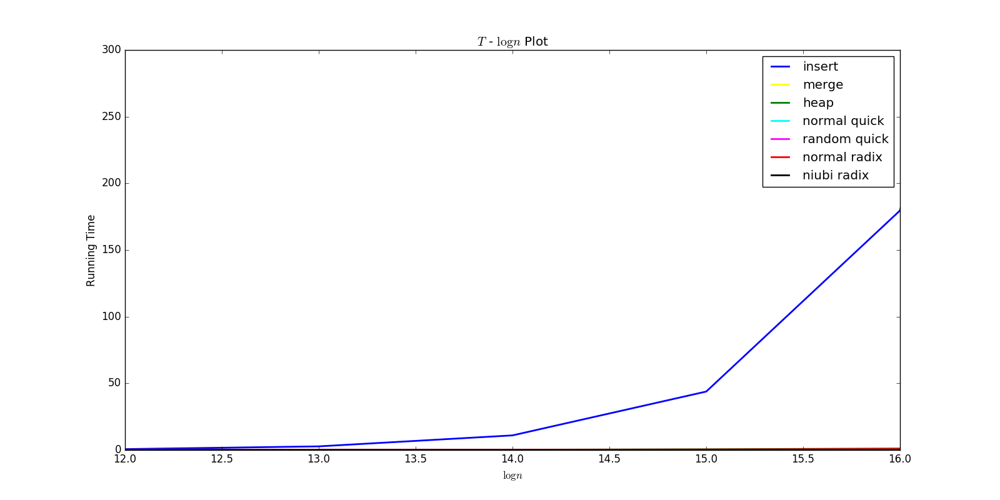
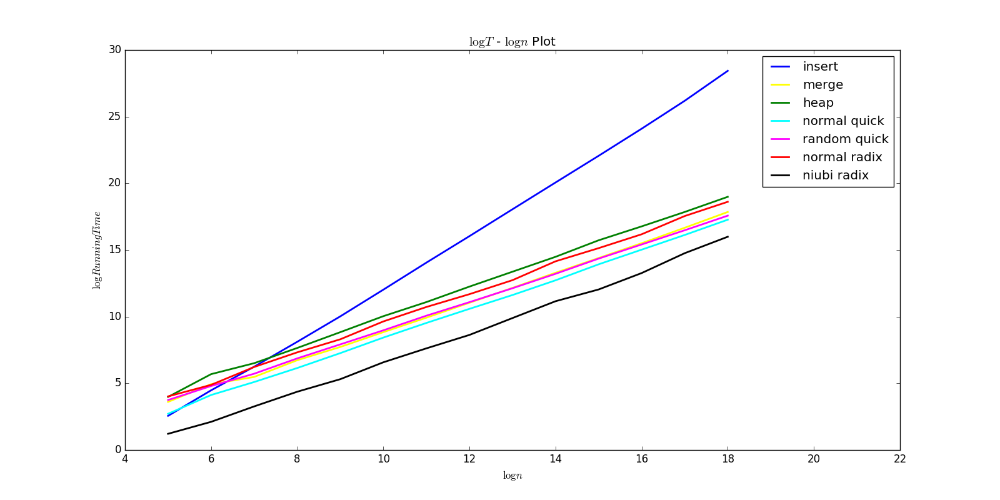
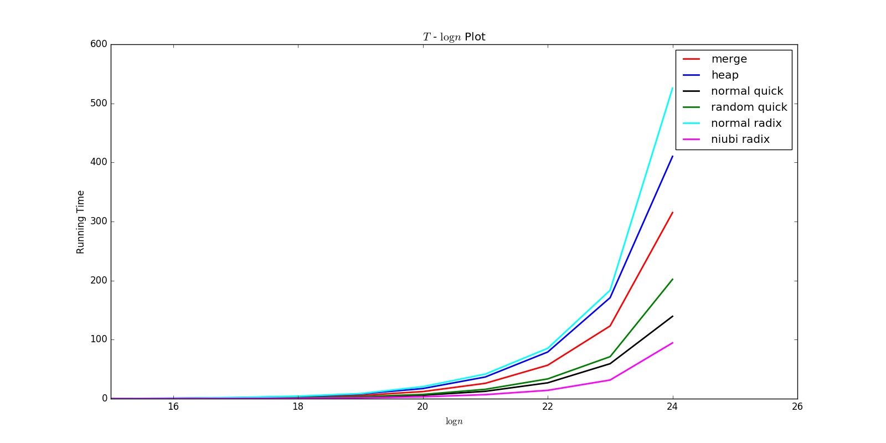
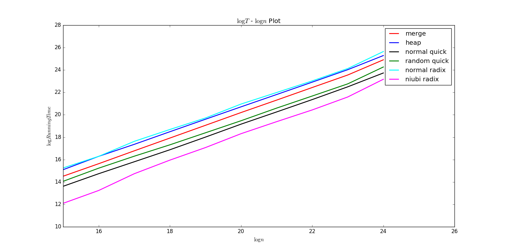

#### 陈潇涵 少年班学院 PB13000689
___

# 实验三：排序 —— 实验报告

## 实验目的

通过实现

* 插入排序
* 归并排序
* 堆排序
* 随机快速排序
* 基数排序（使用了计数排序）

加深对经典排序算法的理解。并通过测量程序运行时间来分析、比较不同排序算法的性能，进一步理解算法的时间复杂度。

## 实验原理

### 插入排序：

我们从数组的第二个元素开始迭代。

**循环不变量**：第 $i$ 次迭代开始前，$A[0,...,i-1]$ 是已经排好序的子序列（升序排列）。

**第 $i$ 次迭代过程**：将 $A[i]$ 分别与 $A[i-1], A[i-2],...A[0]$ 依次比较，直到找到第一个小于等于 $A[i]$ 的元素，记为 $A[j]$，再将 $A[i]$ 分别与 $A[i-1], A[i-2],...A[j+1]$ 依次向后移动一个位置，再将 $A[i]$ 复制到 $A[j+1]$ 的位置。此时 $A[0,...,i]$ 已经是排好序的序列了，循环不变量能够保持。

**时空复杂度分析**：

* 时间复杂度：最坏情况下，即给定的序列是降序序列时，每次迭代时，当前元素都要移动到数组最开头的位置，因此前 i - 1 个元素都要一次往后移动一次。因此时间费用为：$O(1)+O(2)+...+O(n-1)=O(n^2)$。
* 空间复杂度：由于插入排序为就地排序，只需要在移动某一元素是暂时存放它的值，因此空间复杂度为常数 $O(1)$。

### 归并排序

归并排序以分治思想为基础，其思路可以这样表示：

* 分解：将数组分为长度尽量相等的两个子序列（子序列长度差不超过1）。
* 分治：对两个子序列分别应用归并排序得到两个排好序的子序列。
* 合并：将两个子序列合并。

**合并过程**：我们设置一个辅助数组空间，长度与输入数组长度相同。设两个子序列分别为 $A[p]$ 和 $B[q]$，这两个子序列已经被排序为升序序列。每一次我们比较两个序列的第一个元素，将较小者写入辅助数组的相应位置，并将它从自己所在的子序列中删除。重复上述过程。若某一子序列已经为空，则将另一子序列剩下的元素依次写入辅助数组中。

**时空复杂度分析**：

* 时间复杂度：归并排序的时间复杂度 $T(n)$ 由两个子问题和合并操作构成。而合并操作的时间复杂度是线性的，因为合并操作中只需将序列中的每个元素遍历一遍。因此有递推式：$T(n)=2T(\frac{n}{2})+O(n)$。再由主方法我们易得 $T(n)=\Theta(n\log{n}))$。
* 空间复杂度：由于需要开辟一个长度为 $n$ 的辅助数组空间，因此空间复杂度为 $\Theta(n)$。

### 堆排序

**最大堆**：最大堆是一种数组，它可以被看成是一种特殊的接近完全二叉树的二叉树。对于每一个内部节点，其数值都比它的两个子节点的数值更大。由于堆接近完全二叉树，它的树高为 $O(\log{n})$。

**维持最大堆**：对于一个给定的元素 $A[i]$，我们假定它的两棵子树都是最大堆。设 $A[i]$ 的两个孩子分别为 $A[lc],A[rc]$。将 $A[i]$ 分别与 $A[lc],A[rc]$ 比较。若 $A[i]$ 为三者中最大值，则以 $A[i]$ 为根的二叉树已经是最大堆。否则，将 $A[i]$ 与最大者交换位置。设交换后的新下标为 $k$，则对 $A[k]$ 重复该过程，直到以该元素为根的二叉树已经是最大堆或该元素变成了叶子节点。

**建堆**：由于堆是一个近似的完全二叉树，因此堆的叶子节点分别是数组元素中的 $A[\lfloor{\frac{n-1}{2}}\rfloor+1,...,n-1]$。于是我们从第 $\lfloor{\frac{n-1}{2}}\rfloor$ 个元素开始，执行维持最大堆操作，一次执行到 $A[0]$ 元素，这样我们就得到了一个最大堆。

**堆排序**：由于最大堆的根节点是堆中的最大元，我们将根节点与堆中最后一个元素交换位置，将 heap_size 减一，然后对新的根节点应用维持最大堆方法，仍然保持堆为最大堆。注意此时刚刚交换的最大元素已经不参与维持最大堆操作，维持最大堆操作后它已经在堆的最后一个元素之后。如此重复直到 heap_size 减至 1。这样得到的序列将是一个不减序列。这个可以通过循环不变量来证明。

**时空复杂度分析**：

* 空间复杂度：堆排序是就地排序，只需在交换元素时用到一个辅助空间，因此空间复杂度为常数级别。
* 时间复杂度：
    - 维持最大堆：维持最大堆的时间复杂度只根树高相关，因此为 $O(\log{n})$。
    - 构造最大堆：对前 $n/2$ 个元素执行维持最大堆操作，时间复杂度为$\frac{n}{2}O(\log{n})$。
    - 堆排序：循环 $n-1$ 次，时间复杂度为 $(n-1)O(\log{n})$。
    - 综上所述，总的时间复杂度为 $(n-1)O(\log{n}) + \frac{n}{2} O(\log{n}) = O(n\log{n})$。

### （随机）快速排序

快速排序算法仍然是以分治法为基础的：

* 分解：将数组分为三个部分，一个主元，主元左边的子序列和主元右边的子序列。且这个分解满足，左边子序列中的所有元素都不大于主元，主元右边的元素均大于主元。
* 分治：对主元左边的子序列和右边的子序列应用快速排序算法得到排好序的子序列。
* 合并：不需合并，此时整个序列已经是有序的。

**分拆**：我们选取数组的最后一个元素为主元。我们从数组的第一个元素开始，迭代到数组的倒数第二个元素。迭代时，我们用两个游标 $i$ 和 $j$，分别指向主元左边序列的最后一个元素，和主元右边子序列的最后一个元素，因此迭代开始时 $i=-1,j=1$。进行第 $k$ 次迭代时($k = 0,1,...,n-2$)，将 $A[k]$ 与主元相比较，若 $A[k]$ 大于主元，则 $A[k]$ 应位于主元右边，$j$ 自增；否则，$A[k]$ 应位于主元左边， $i$ 自增，交换 $A[i]$ 和 $A[k]$，$j$自增。第 n-2 次迭代结束后，自增 $i$，交换主元和 $A[i]$。返回 $i$。

**分析**：这样进行拆分有两点不足：
* 这样分拆会导致排序不稳定。即相同关键值的元素间的相对位置可能会发生变化。
* 算法的时间复杂度依赖于输入的分布。最坏情况下，即每一次分拆后，主元恰好都正好落在数组的最后一个位置上。如果这样的最坏情况发生，我们可以写出时间复杂度的递归式 $T(n)=T(n-1)+O(n)$，通过代换法可以证明 $T(n)=\Theta(n^2)$，时间复杂度太高。

**优化 —— 随机快速排序**：随机快速排序运用随机分拆方法，使得期望意义下快速排序的时间复杂度为 $\Theta(n\log{n})$。随机分拆方法和普通的分拆方法基本相同，只是在选取主元时，我们从 $A[0,...,n-1]$ 。然后进行与普通分拆相同的操作。可以证明在期望意义下，这样进行排序的时间复杂度为 $O(n\log{n})$。

**时空复杂度分析**：

* 空间复杂度：快速排序是就地排序，空间复杂度依然是常数级别。
* 时间复杂度：普通快速排序在最坏状况下时间复杂度为 $O(n^2)$，对于均匀分布的输入，其平均时间复杂度为 $O(n\log{n})$。随机快速排序在期望意义下时间复杂度为 $O(n\log{n})$。

**随机快速排序期望时间复杂度的证明：**

我们设随机快速排序的时间复杂度为 $T(n)$。对于一个长度为 n 的序列，将恰好第k小的元素被选取为主元的事件记为 $X_k$，其指示器随机变量记为 $I_k$。于是有

$$E[T(n)]=E[\sum_{k=1}^{n}I_k(T(k-1)+T(n-k)) + n - 1].$$

由于每次都是随机地选取主元，因此随机变量 $I_k$ 与 $T(k-1)$ 和 $T(n-k)$是相互独立的。于是就有：

$$
\begin{split}
E[T(n)] &= \sum_{k=1}^{n}E[I_k](E[T(k-1)]+E[T(n-k)])+n-1       \\\
        &= \sum_{k=1}^{n}\frac{1}{n}(E[T(k-1)]+E[T(n-k)])+n-1  \\\
        &= \frac{2}{n}\sum_{k=1}^{n-1}E[T(k)]+n-1
\end{split}
$$

为了方便，我们将 $E[T(n)]$ 记为 $E(n)$。于是有：

$$
\begin{equation}\label{eq1}
E(n) = \frac{2}{n}\sum_{k=1}^{n-1}E(k) + n - 1
\end{equation}
$$
$$
\begin{equation}\label{eq2}
E(n-1) = \frac{2}{n-1}\sum_{k=1}^{n-2}E(k) + n - 2
\end{equation}
$$

联立 $\eqref{eq1}\eqref{eq2}$ 两式可得，
$$
\begin{split}
E(n) &= \frac{n+1}{n}E(n-1) + 1                                 \\\ \\\
     &= \frac{n+1}{n}(\frac{n}{n-1}E(n-2)+1) + 1                \\\ \\\
     &= \frac{n+1}{n-1}E(n-2) + \frac{n+1}{n} + 1               \\\ \\\
     \\\
     &= \cdots                                                  \\\
     &= \frac{n+1}{2}E(1) + (n+1)\sum_{k=3}^{n+1}\frac{1}{k}    \\\ \\\
     &= \Theta(n)+\Theta(n\log{n})                              \\\ \\\
     &= \Theta(n\log(n))
\end{split}
$$

结论得证。

### 基数排序

基数排序只能针对整数进行排序。其方法描述如下：

从最低位开始，先以最低位的数为关键值对所有数进行排序；再以次低位的数为关键值进行排序；依次进行排序步骤直到最大数的最高位也已经排序过。

基数排序的正确性依赖于在每一位使用的子排序方法的稳定性。

**时空复杂度分析**：

* 时间复杂度：给定 n 个 d 位数，每一个数位可以取 k 种可能的值。基数排序算法能以 $\Theta(d(n+k))$ 的时间正确地对这些数进行排序。因此，若 d 是常数，则基数排序可以在 $\Theta(n)$ 即线性时间内完成。
* 空间复杂度：基数排序的空间复杂度依赖于其所选择的子排序算法，以计数排序为例。基数排序需要一个长度为 k 的辅助数组空间。再加上基数排序还需要长度为 n 的辅助数组空间来存储所有元素的某一位的值，又产生了 n 的空间复杂度。因此基数排序的空间复杂度为 $O(n+k)$。

### 计数排序

计数排序只适用于要比较的关键值的种类较少的情形，且一般只适用于整数排序。

**算法思想**：

对每个元素 $x$，统计出小于 $x$ 的元素的个数。然后根据这一信息将元素 $x$ 直接放到它在最终输出数组中的位置上。

**算法过程**：

1. 将辅助数组空间 $C[0,...,k-1]$ 初始化为 0。（假设将要排序的元素共有 k 种可能的取值。
2. 对输入数组进行一遍扫描。扫描过程中，统计每个元素出现的次数，并将该信息存储在辅助数组空间 $C$ 中。
3. 对 $C$ 进行一边扫描，将 $C$ 中每一个元素加到后一个元素上，这样 $C[i]$ 中存储的是小于等于 $i$ 的元素的个数。
4. 对输入数组从尾至头扫描一遍（从尾至头的顺序是为了保持计数排序的稳定性），对每个元素，找到 $C[i]$ 中存储的信息表示的位置，将元素复制到输出数组的相应位置，$C[i]$ 自减。

**时空复杂度分析**：

* 时间复杂度：从上面的算法过程分析可知，我们对输入数组扫描了两遍，对辅助空间数组扫描了两遍。因此时空复杂度为 $\Theta(n+k)$。
* 空间复杂度：由于需要用到存储结果数组和辅助数组空间，计数排序的空间复杂度为 $\Theta(n+k)$。

## 实验内容

### 插入排序：

```python
def insert_sort(source):
    if len(source) <= 1:
        return
    else:
        for i in range(1, len(source)):
            temp = source[i]
            j = i
            while j > 0 and source[j - 1] > temp:
                # j starts from i to 1
                source[j] = source[j - 1]
                j = j - 1
            source[j] = temp
```

### 归并排序：

```python
def merge_sort(source, start_index, end_index, target):
    if end_index - start_index > 1:
        # Devide the problem into two sub-questions and apply merge_sort().
        middle = (start_index + end_index) / 2
        merge_sort(source, start_index, middle, target)
        merge_sort(source, middle, end_index, target)

        # Merge to sorted sequences obtained from merge_sort().
        i = start_index     # pointer to the first sub-sequence
        j = middle          # pointer to the second sub-sequence
        k = start_index     # pointer to target
        while i < middle or j < end_index:
            if j >= end_index or (i < middle and source[i] <= source[j]):
                target[k] = source[i]
                i = i + 1
                k = k + 1
            else:
                target[k] = source[j]
                j = j + 1
                k = k + 1
        for i in range(start_index, end_index):
            source[i] = target[i]
```

### 堆排序：

**维持最大堆**：

```python
def max_heapify(source, i, heap_size):
    lc = left(i)
    rc = right(i)
    if lc < heap_size and source[lc] > source[i]:
        largest = lc
    else:
        largest = i
    if rc < heap_size and source[rc] > source[largest]:
        largest = rc
    if largest is not i:
        exchange(source, i, largest)
        max_heapify(source, largest, heap_size)
```

**建堆**：

```python
def build_max_heap(source):
    heap_size = len(source)
    for i in xrange(heap_size / 2 - 1, -1, -1):
        # i start from  |_n/2_| - 1  to 0
        max_heapify(source, i, heap_size)
```

**维持最大堆**：

```python
def heap_sort(source):
    build_max_heap(source)
    for i in xrange(len(source)- 1, 0, -1):
        # i starts from heap_size - 1 to 1
        exchange(source, 0, i)
        max_heapify(source, 0, i)

```

### 随机快速排序

**分拆**：

```python
def partition(source, start, end):
    key = source[end - 1]
    i = start - 1
    for j in xrange(start, end - 1):
        if source[j] <= key:
            i = i + 1
            exchange(source, i, j)
    exchange(source, i + 1, end - 1)
    return i + 1

```

**随机分拆**：

```python
def randomized_partition(source, start, end):
    i = random.randint(start, end - 1)
    exchange(source, i, end - 1)
    return partition(source, start, end)
```

**快速排序**：

```python
def randomized_quick_sort(source, start, end):
    if end - start > 1:
        middle = randomized_partition(source, start, end)
        randomized_quick_sort(source, start, middle)
        randomized_quick_sort(source, middle + 1, end)
```

### 基数排序

这个牛逼的简短的 python 实现。

```python
import random
def radixSort(A, d):
    for k in xrange(d):
        s=[[] for i in xrange(10)]
        for i in A:
            s[i/(10**k)%10].append(i)
        A=[a for b in s for a in b]
    return A
```

## 实验分析

这一次的实验全部是排序实验，因此实验分析方法非常简单：产生随机数组，排序，记录运行时间，求平均，画图即可。

实验结果如下：（实验过程中，每种输入规模下的每种排序方法我都排序了五次然后取平均，且每次排序的输入数组都是不同的）

说明：快速排序有两种，一种是普通快速排序，一种是随机快速排序。基数排序我也分了两种，一种是我自己写的 normal_radix，一种是在网上找到的别人的实现 niubi_radix。



从图中可以看到，当 $\log{n}$ 取到 14 及以上的时候，插入算法的运行时间已经及其难以忍受，这样画出来的图效果非常不好。为了更清晰地比较这些算法的性能，我又画了 $\log{T} - \log{n}$ 图：



注意，各个算法的时间复杂度求对数后应该为如下：

* 插入排序为 $2\log{n}$
* 归并排序、堆排、快排均为 $\log{n} + \log{\log{n}}$。
* 两种基数排序为 $\log{n}$

因此，插入排序的斜率应该约为其他排序算法图形斜率的两倍，这一预测和我们实验中作出的图像基本相符。

闲着无聊，我于是想比较一下，除开插入排序之外的其它的几个排序算法在输入规模很高的情况下的性能优劣，于是有了下面这两张图。

 

 

可以看到，除了插入排序，其他算法斜率基本一致，即运算时间基本只有倍数差别。我们下面分析这些排序算法的运算速度的差异源于哪些因素。

* 我自己写的基数排序是最慢的，而网上找到的基数排序是最快的，二者的速度差了将近6倍。这对我是很大打打击（T。T）。原因在于，网上的基数排序，除了基本运算，只用到了 list 类型的 append 操作，而我却先初始化数组（相当于遍历一遍了），然后再遍历很多遍一个一个赋值，速度当然差了很多（内建函数的优化当然比我写的代码要快得多）。
* 堆排序相对来说也非常慢。我也没想明白它哪里慢了，难道是递归？
* 我写的普通快速排序比随机快速排序要快一些些，原因很明显：因为我产生的是随机输入数组，因此输入基本可以看成是均匀分布了。普通快速排序的速度就和随机快速排序速度相同了，然而随机快速排序还要随机选择主元，速度自然慢了许多。

## 实验总结

这一次实验也比较顺利，终于在算法基础课上把这些排序算法都实现了一遍。在实现这些算法的过程中，我尽量没有看书，而是在自己的脑海中回忆各种排序算法的思想以及一些细节，凭着自己的理解来写出自己的程序，所以虽然实验难度不大，但是我自己还是感觉收获颇丰。

第二个特别大的收获就是：看到了一些很牛逼的 python 程序，真的好厉害，好精炼，看起来就很舒服。感觉自己还是用 c 的方式去写 python，有时间可以去琢磨琢磨 python 的一些“奇技淫巧”。

第三个收获就是，一个好的实现方法对于速度的影响还是非常大的。别人写的基数排序不仅更符合 python 程序精炼、优雅的特点，而且速度是我写的基数排序的好几倍！看来自己真的要锻炼自己如何快速、优雅地写出高效的代码的功夫了。

第四个，也是最大的收获了：我从这次实验中，真正体会到了一个伟大的算法的伟大意义！从 $\Theta(n^2)$ 到 $\Theta(n\log{n})$ 的意义是非同凡响的。当输入规模大到一定程度时，堆排、快排的效率跟插入排序比起来不知道高到哪里去了。虽然这个结论我们早就可以预见到了，但是真正实验中，等着插入排序结束的痛苦与堆排、快排、基数排序的快捷之间的对比，仍然是给了我很大的震撼！算法真的太厉害了！
