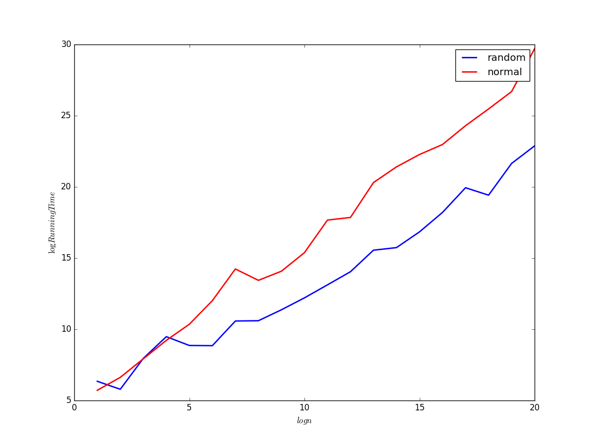
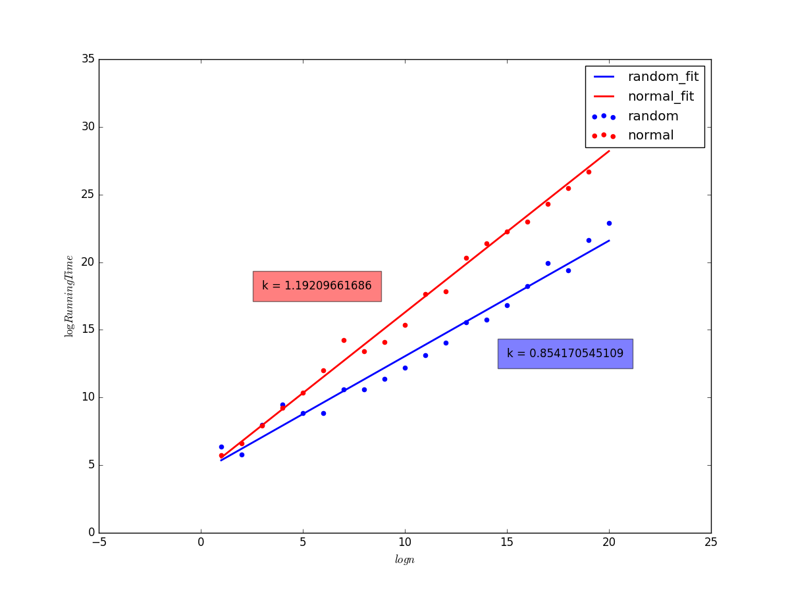

# 实验四：顺序统计量——实验报告

### 陈潇涵 PB13000689 少年班学院

## 实验目的

实现从给定数组中找到指定顺序统计量的算法。

## 实验原理

### 一般思路：

本次实验的思路仍然是分治，整个算法的实现过程跟快速排序很相似：

1. 分解：找到一个主元，将整个数组分成左右两部分。左边部分的每个元素都小于等于主元，右边部分的每个元素都大于主元。将主元的位置与要求的顺序统计量的顺序进行比较。
2. 分治：递归地在子数组中查找相应的顺序统计量。
3. 合并：合并是平凡的，无需合并。

### 期望意义下为线性时间的算法：

期望意义下为线性时间的算法的主元选取是随机的，因此，如同随机快速排序算法期望时间复杂度的证明，我们可以证明，随机选择算法期望意义下的时间复杂度是线性的。

### 最坏情况下为线性时间的算法：

最坏情况下为线性时间的算法，它的特殊之处在于，希望在每一次选择的主元尽可能好。用如下方法来达到这个目的：

1. 假设我们要选择出第 k 个顺序统计量。
2. 将输入元素 5 个为一组进行分组，最后一组有 $n mod 5$ 个元素。
3. 对每一组元素进行排序，选取中位数。
4. 递归地对选取出的 $\lfloor{n/5}\rfloor$ 中的中位数。
5. 以选出的这个数为主元，后面的操作与随机选择算法相同。

可以证明，如此操作，最坏情况下的时间该算法的时间复杂度为线性时间复杂度。

## 实验内容

### 说明

值得注意的是，我在试验中使用的、返回的任何下标都是从输入数组的第一个元素开始计数的绝对下标，而不是相对于 start 的相对下标。

### Randomized Select

```python
def randomized_select(source, start, end, k):
    if len(source) < k:
        return "wrong index k"
    i = sort.randomized_partition(source, start, end)
    if i == k - 1:
        return source[i]
    elif i > k - 1:
        return randomized_select(source, start, i, k)
    else:
        # Here k is the absolute index for 0
        return randomized_select(source, i + 1, end, k)
```

### Select

```python
def select(source, start, end, k):
    if (end - start) <= 140:
        sort.normal_quick_sort(source, start, end)
        return [source[k - 1], k-1]
    length = end - start

    # select a better key element
    for i in xrange(length/5):
        sort.insert_sort(source,start + i*5, start + i*5 + 5)
        temp = source[start + i]
        source[start + i] = source[start + 5*i + 2]
        source[start + 5*i + 2] = temp
    [i, index] = select(source, start, start + length/5, length/10)
    
    # partition
    temp = source[index]
    source[index] = source[end - 1]
    source[end - 1] = temp
    j = sort.partition(source, start, end)
    
    if j == k:
        return [source[j], j]
    elif j > k:
        return select(source, start, j, k)
    else:
        return select(source, j + 1, end, k)
```

## 实验中出现的问题

这次试验中碰到的问题主要有两个：

### 绝对下标和相对下标：
一开始，我把顺序统计量、元素下标的相对性和绝对性搞混了。

在递归调用时，如果要求的顺序统计量在主元右边，算法是这样的：

```python
select(source, i + 1, end, k - i - 1)
```

但是这样是用了相对 start 的相对下标。然而我的 partition 返回的是数组 source 的绝对下标，这样就造成了混乱。

最终我的解决办法统一用绝对下标，上面的语句修改为：

```python
select(source, i + 1, end, k)
```

### Select 算法中找下标的问题：
Select 算法中，入口函数返回的是第 k 个顺序统计量的值，但是在 Select 的实现中，我们递归调用 Select 方法时，需要的信息不仅仅是值，我们可能还需要找到元素的下标。这就有了一些问题。我的解决方法用到了 python 的特性，返回了 [value, index] 这样的一个 list 。但是更优雅的解决方式我还没有想到。

## 实验分析

实验分析仍然主要是时间分析。作出 $\log{Running Time} - \log{n}$ 图， $\log{n}=1,2,3,\ldots,20$，纵坐标扩大了一千万倍后再求对数的结果。



为了更好的比较两者速率，我们用最小二乘法进行线性拟合，作出如下图像：



从图中可以看到，两个曲线的斜率是有明显差别的，然而这是 $\log{t}-\log{n}$ 图，这个斜率的差异实际上是时间复杂度的指数级别的差异，这个差距还是很大的。

究其原因，虽然普通的 Select 方法在最坏情况下为线性，但是这个方法的其它开销比起随机选择算法是相当大的，因此可能只有在 n 很大的情况下，普通算法才能体现其优势，但是 n 很大的时候，我的计算机已经很吃力了。再加上由于测试时用的就是随机产生的，因此随机算法的性能可能体现的比较好。

## 实验总结

本次实验比较简单，几乎是直接把快速排序的算法拿过来改了改就好了，因此比较顺利。