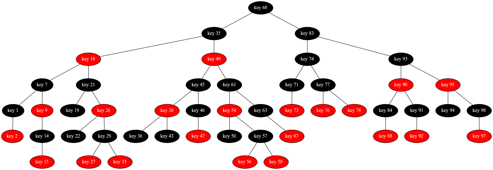
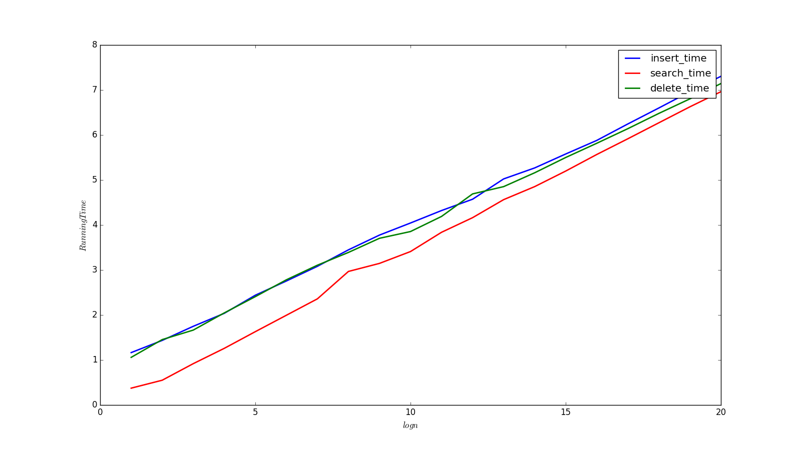

# 实验五、六：红黑树及其扩展

### 陈潇涵 PB13000689 少年班学院

### 说明：因为我想自己捋一遍红黑树这一章的内容，因此报告中可能有很大一部分内容和书中重复，但都是根据我自己的理解写的。

## 实验目的

实现经典的动态数据结构——红黑树，实现红黑树的查找、旋转、插入、删除操作，并利用 Graphviz 进行树的可视化。并且在红黑树的基础上，实现了红黑树数据结构的两种扩展——顺序查找树和区间数，通过这两种扩展的实现理解数据结构的扩展过程，从而理解我们平时学的这些（抽象的）数据结构在现实中到底是如何应用的。

## 实验原理

### 红黑树

#### 红黑树的定义

红黑树是满足以下性质的二分查找树：

1. 红黑树中的节点要么是红色，要么是黑色
2. 根节点是黑色的
3. 从任意一节点开始，从它到叶子节点的任一路径上的黑节点的数目相同（不包括自己）
4. 红色节点的孩子必须都是黑色节点，即红色节点不相邻
5. 每个叶子节点的左右孩子均为哨兵节点，且哨兵节点为黑色

#### 红黑树数据结构的意义

红黑树数据结构存在的意义，即它的优势在于，它是一颗很平衡的二分查找树。可以证明，含有 $n$ 个节点的红黑树的高度不超过 $2\log{n+1}$ 。因此红黑树上的许多操作均能在 $O(\log{n})$ 的时间复杂度内完成，因此它的效率非常高。

证明树高不超过 $2\log{(n+1)}$ 的简单思路如下：

先用数学归纳法证明以 $x$ 为根的红黑树的内部节点数不超过 $2^{bh(x)} - 1$ ，其中内部节点指不包括哨兵节点， $bh(x)$ 指 $x$ 的黑高。这个可以用数学归纳法证明。根据红黑树定义中红色节点不相邻的性质，我们可以得到根节点的黑高至少是 $\frac{h}{2}$ ，因此有

$$ n \geq 2^{bh(x)} - 1 \geq 2^{\frac{h}{2}} - 1 $$

亦即

$$ h \leq 2\log{(n+1)}. $$

证毕。

#### 红黑树的旋转

红黑树的插入、删除操作可能会破坏红黑树的结构，因此需要旋转操作来帮助我们维护红黑树的性质。由于红黑树的右旋和左旋操作是完全对称的，下面以红黑树的左旋为例：

对节点 $x$ 进行左旋是将 $x$ 的右孩子 $y$ （如果不是 nil 节点）旋转到 $x$ 的位置，$x$ 变为 $y$ 的左孩子， $y$ 的左孩子变为 $x$ 的右孩子。由于涉及到指针的操作，我们需要按一定顺序进行上述步骤才能保证旋转操作的正确性。因此正确的顺序应该为如下所示：

1. 如果 $x$ 是 nil 或 $x$ 的右孩子是 nil，退出操作
2. 将 $x$ 的右孩子替换为 $y$ 的左孩子。
3. 将 $y$ 的左孩子的父亲变为 $x$ 。
4. 将 $y$ 的父亲改为 $x$ 的父亲。
5. 如果 $x$ 是根，将根改为 $y$ ，否则如果 $x$ 是其父亲的左孩子，则将父亲的左孩子改为 $y$ ，否则将父亲的右孩子改为 $y$。
6. 将 $y$ 的左孩子改为 $x$ 。
7. 将 $x$ 的父亲改为 $y$ 。

#### 红黑树的插入

红黑树的插入分为两步，第一步将插入节点按照与二分查找树相同的方式插入到红黑树中，并且将其颜色赋为红色，然后再调用 insert_fixup 函数来维护红黑树的性质：

由于插入节点的颜色为红色，并且是树的叶子节点，它并不改变任何一个节点的黑高，而且它的孩子节点均为哨兵节点为黑色，因此只有该节点的父亲节点的颜色为红色或该节点被插入为根节点时才会违反红黑树的性质。因此我们重复以下步骤，每进行一次都红黑树性质的矛盾向上推一层，知道父亲节点的颜色为黑色，或者矛盾已经被推到根：

矛盾上移的操作将根据叔叔节点不同的颜色情况有所不同，共有下面几种情况：（我们假设父亲节点是祖父节点的左孩子，因为若是祖父节点的右孩子，以下操作完全对称）

设 $z$ 为被插入的节点。

##### Case 1：$z$ 的叔叔节点的颜色为红色

若 $z$ 的叔叔节点的颜色为红色，那么我们可以将 $z$ 的父亲和叔叔节点的颜色都改为黑色。这样可能产生的问题是 $z$ 的祖父及其以上的节点的黑高将变得不平衡，于是我们将 $z$ 的祖父节点的颜色改为红色。这样只有 $z$ 的祖父的父亲节点的颜色为红色或者 $z$ 的祖父节点为根才会破坏红黑树性质，这和 $z$ 的情况相同，于是我们将 $z$ 的祖父作为新的 $z$ ，再次进入循环。

##### Case 2 or 3：$z$ 的叔叔节点的颜色为黑色

Case 2 和 Case 3 的区别在于， $z$ 是其父亲的左孩子还是右孩子，如果 $z$ 是右孩子（Case 2），那么我们对其父亲进行一次左旋操作，然后将 $z$ 的父亲（现在是 $z$ 的左孩子）作为新的 $z$。这样 Case 2 就被转化成了 Case 3 且不改变任何其他的情况。

##### Case 3：

将 $z$ 的父亲节点的颜色改为黑色，将 $z$ 的祖父节点的颜色改为红色，然后对 $z$ 的祖父进行一次右旋操作，这样 $z$ 的祖父节点变为 $z$ 的兄弟节点，这时 $z$ 的父亲节点已经是黑色的了，将退出循环。

##### 退出循环

由于可能因为 $z$ 为根，其父亲是黑色的哨兵节点而退出循环，因此我们最后需要再将红黑树的根赋为黑色。这样 insert_fixup 操作就完成了。

#### 红黑树的删除

红黑树的删除分为两步，普通的二分搜索树中的删除，以及 delete_fixup 操作。

##### 删除节点

与二分查找树不同的是，由于删除过程中我们可能破坏红黑树的性质，因此我们需要一些额外的信息来帮助我们进行删除操作。这个额外的信息就是——被删除的节点的原来的颜色。

在这里有个非常重要的地方要理解：被删除的节点只会是叶子节点或者是只有一个孩子的节点。对于有两个孩子的节点，我们做的只是将它的后继替换到这个该节点的位置，并且拥有相同的颜色。因此真正被删除的只是它的后继，而它的后继只可能是叶子节点后者是只有右孩子的节点。

因此，如果被删除的节点为红色，那么红黑树的性质将不会被破坏，原因是在删除之后：

1. 红黑树中的每个节点的黑高都没有发生变化。
2. 不会有两个相邻的红点。
3. 根仍然是黑色的。因为根是黑色的，所以被删的一定不是根。

所以，之后在被删除的节点 $y$ 原来的颜色是黑色的时候，删除该节点可能导致三种问题而破坏红黑树的性质：

1. $y$ 原来的父节点和子节点都是红色的，那么会导致两个相邻的红节点存在。
2. $y$ 是黑色的，导致黑高不均衡。
3. 删除了根而一个红节点做了根。

因此，如果上述情况出现，我们就需要进行 delete_fixup(x) 操作来维护红黑树性质，其中 x 是被删除节点的孩子（可能是哨兵节点）。

##### delete_fixup

delete_fixup 的思想仍然是将矛盾上移，直到 $x$ 所指的节点为根节点或其颜色为红色。操作同样因 $x$ 是其父亲的左孩子还是右孩子而不同，但两者操作是对称的，因此我们下面只考虑 $x$ 是其父亲的左孩子的情况。

设 $x$ 的兄弟节点为 $w$。

###### Case 1：$w$ 的颜色为红色

那么我们将 $w$ 的颜色改为黑色，父亲节点的颜色改为红色。再对 $x$ 的父亲进行左旋操作，再将 $w$ 改为 $x$ 现在的兄弟节点（即原来 $w$ 的左孩子）。由于原来的 $w$ 的颜色是红色，因此它的左孩子一定是黑色，这样就将 Case 1 变为了 Case 2。

###### Case 2：$w$ 的颜色为黑色，且孩子均为黑色

如果 $w$ 的左右孩子均为黑色的，那么我们可以直接将 $w$ 的颜色改变为红色， $x$ 上移一层。然后直接进行下一次迭代。此时若新的 $x$ 的颜色为红色，那么退出循环，将其颜色改为黑色。此时易知 $x$ 以上的节点的黑高都重新恢复平衡，红黑树的性质已经被恢复了， delete_fixup 操作完成。

###### Case 3：$w$ 的颜色为黑色，但左孩子红色，右孩子黑色

我们通过交换 $w$ 和其左孩子的颜色，然后对 $w$ 进行右旋操作，这样的操作不改变黑高，且不会出现红节点相邻，红黑树性质保持，并且将 Case 3 转换成了 Case 4。

###### Case 4：$w$ 的颜色为黑色，但左孩子黑色，右孩子红色

将 $w$ 和 其父亲节点的颜色互换，将 $w$的右节点的颜色改为黑色，对 $w$ 的父亲进行左旋操作。这样，由于被删节点导致的 $x$ 以上的节点的黑高不平衡由于 $w$ 父亲被左旋而得到了补偿，同时其他节点的黑高都保持平衡，因此此时红黑树的性质已经被恢复了。于是我们将 $x$ 置为根，以方便下次迭代开始时退出循环。

退出循环后，将 $x$ 的颜色改为黑色，以确保从 Case 2 和 Case 4 退出循环后，将目前的 $x$ 的颜色改为黑色。

#### 红黑树的查找：

红黑树的查找方法同二分查找树。

### 红黑树的扩展——顺序统计树

顺序统计树即在红黑树的基础上添加上一附加信息 $x.size$，表示以 $x$ 为根的子树中所有内部结点的总数目。它可以递归地定义为

$$
\begin{eqnarray*}
&& x.size = x.left.size + x.right.size + 1 \\\
&& nil.size = 0
\end{eqnarray*}
$$

我们只需要在旋转、插入、删除等操作中始终保持维护这个 size 的信息即可。

#### 使用顺序统计树访问第 k 小的数

对每个节点 $x$，我们知道它是第 $x.left.size + 1$ 小的数，因此我们只需要将 k 与这个数相比较。

* k = $x.left.size + 1$：则已经找到了第 k 小的数
* k < $x.left.size + 1$：则在左子树中查询第 k 小的数
* k > $x.left.size + 1$：则在有子树中查询第 $k - x.left.size + 1$ 小的数

#### 使用顺序统计树查询元素 $x$ 是第几个顺序统计量

只需先查找到 $x$ 元素然后返回 $x.left.size + 1$ 即可。

### 红黑树的扩展——区间树

区间树的每个节点表示一个区间，它包含区间下界 $x.low$，区间上界 $x.high$，以区间下界为主键值，并且含有附加信息 $x.high$，它表示以 $x$ 为根的子树中的所有区间的最大上界。

$$
\begin{eqnarray*}
&& x.max = max(x.left.max, x.right.max, x.high) \\\
&& nil.max = -\infty
\end{eqnarray*}
$$

我们只需要在旋转、插入、删除等操作中始终保持维护这个 max 的信息即可。

#### 使用区间树查找一个重叠区间

使用区间树查找一个重叠区间的最坏情况下的时间复杂度为 $O(\log{n})$ 。如果该区间树存在区间与给定区间重合，那么搜索算法一定能给出一个重叠区间。能做到这一点关键在于，对于每一个节点，如果该节点区间不与给定区间重合，那么我们选择一条最安全的路径继续搜索。在这里安全的意思是，沿着这条路往下走，子树中一定含有与给定区间重合的节点。

具体选择的方法如下：

1. 如果当前结点是哨兵节点或当前节点区间与给定区间重合，则退出循环
2. 否则，如果当前结点左孩子不为哨兵节点，并且左孩子的 max 值大于等于给定区间的下界，则将左孩子置为当前节点，进入下一次循环
3. 否则，将右孩子置为当前节点，进入下一次循环

这个操作的正确性证明如下：

假设以当前节点 $x$ 为根的子树中含有重叠区间。如果 $x$ 的左孩子为哨兵节点，显然重叠区间应该在右子树中。如果 $x.left.max$ 大于给定区间下界，我们通过反证法来证明左子树中一定还有重叠区间。

假设上述情况下，左子树中无重叠区间。因为 $x.left.max >= low$，因此左子树中存在某个节点 $y$ 满足 $y.high = x.left.max$。然而该区间不与给定区间重合，唯一的可能是 $y.low > high$。然而区间树以区间下界为关键值，而右子树的任意节点的关键之大于左子树的节点的关键值，因此右子树的任意节点的区间下界大于给定区间的上界，因而右子树中同样不含重叠区间。然而这与以当前节点 $x$ 为根的子树中含有重叠区间的假设相矛盾。得证。

#### 使用区间树查找所有重叠区间

这个比较简单，用递归算法即可，最坏情况下的时间复杂度为 $O(n)$。

## 实验中出现的问题

这次红黑树及其扩张的两个实验比较难，代码量较大，特别是红黑树的插入和删除操作特别难以理解。我在试验中感到困难的地方有这些：

#### 红黑树的插入和删除

这个不用说，几乎是这次试验中最困难的部分了。

#### 区间树节点 max 信息的维护

这个地方一开始感到比较困难，因为感觉它的维护不像顺序统计树中 size 信息的维护，只要沿着树往下一直到 x ，路径上的每个节点的 size 减一即可。但是这种方法不能用在区间树上，因为如果删除的节点的区间上界正好是一条路径上很多节点的 max 值，这样这一条路径上的 max 值都需要修改，而且要修改的值依赖于其孩子的 max 值，因此我一下感到有些困难。

但是后来我想到，这种从下往上的修改就像是递归搜索节点时的回退过程，因此写了一个递归的维护 max 信息的函数，他先对子节点递归调用自己，再维护自己的 max 信息。这样就能正确地得到 max 信息的值。

#### 区间树中查找某一个重叠区间的操作

这个地方比较难理解吧，因为不仔细想一想总会觉得可能出现有重叠区间但是找不到的情况。但是仔细看了书上的证明过程，觉得这个还是很 brilliant 的！

## 实验分析

#### 红黑树的形态和可视化

先贴上一张红黑树的可视化图片：（虽然不是很难但是很有成就感！）

 

#### 红黑树插入、查找、删除的运行时间

再贴上插入、搜索、删除的 RunningTime - $\log{n}$ 图：

 

#### 和顺序统计量试验中 select 的比较

$2^20$ 个数的搜索红黑树一共只花了10秒，也即是说搜索的时间基本上是微秒级别。而顺序统计树的 select 只是搜索再返回 x.left.size + 1，因此它的运行时间就是搜索的运行时间——微秒级别。然而 $2^20$ 个数的随机化选择算法的运行时间为 0.4 秒，顺序统计树相当快。然而这只是因为建好的顺序统计树比一个普通的随机数组的信息量要大得多。如果算上建树的过程（20秒左右），还是随机化选择算法更快一些。然而如果将红黑树作为一种长期使用的动态数据结构，它的优势相当明显。因为他上面的一切操作基本上都可以在 $O(\log(n))$的时间复杂度内完成。

## 实验总结

这次实验好难！但是可视化的结果让我特别兴奋。并且在这次实验过程中有一点点自己变强了的感觉！总之收获颇多！