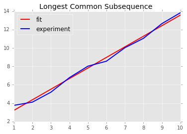
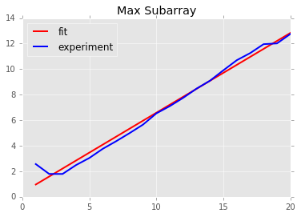
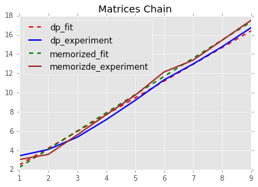

# 实验七：  动态规划

### 陈潇涵 PB13000689 少年班学院

## 实验目的

实现动态规划算法的几个应用——最长公共子序列问题，矩阵链乘积问题和最大子段和问题。个人觉得动态规划好难啊，对于一个不知道解决方法的问题根本不知道怎么用动态规划的方法去解决，而对一个动态规划问题的算法理解起来都需要很久……不过效率真的非常高。

## 实验原理

### 最长公共子序列

最长公共子序列的动态规划算法依赖于如下的最优子结构：

假设我们已知所有规模小于 $x_{1}x_{2}\ldots x_{m},y_{1}y_{2}\ldots y_{n}$ 的最长公共子序列的解。那么面对下一对字符 $x_m,y_n$，有以下两种情况：

1. **$x_m = y_n$**: 这时将 $x_m,y_n$ 分别添加到 $x_{1}x_{2}\ldots x_{m-1},y_{1}y_{2}\ldots y_{n-1}$ 的最长公共子序列中，则的到了长度多 1 的公共子序列。可以用粘贴法证明这个解是一个最优解。

2. **$x_m \neq y_n$**: 这时，我们比较 $x_{1}x_{2}\ldots x_{m},y_{1}y_{2}\ldots y_{n-1}$ 和 $x_{1}x_{2}\ldots x_{m-1},y_{1}y_{2}\ldots y_{n}$ 的最长公共子序列，取较长的那个作为 $x_{1}x_{2}\ldots x_{m},y_{1}y_{2}\ldots y_{n}$ 的最优解。

根据这样的最优子结构的特点，我们可以在算法中维持一张表，表的大小为 $(m+1)\times(n+1)$，第一行和第一列均为0，表示任意一个序列和空序列的最长公共子序列的长度为0。对表中元素 a[i,j]，计算公式如下：

$$
a[i,j] =
\begin{cases}
a[i-1,j-1] + 1          & x[i] = y[j] \\
\\
max(a[i-1,j], a[i,j-1]) & x[i] \neq y[j]
\end{cases}
$$

### 矩阵链乘积

对于给定的 n 个适应的矩阵，它们的维度可以表示为 n+1 维的向量 A[0,1,...,n]，下面要求解 S[0,n]，其中 S[i,j] 表示到第 i+1 个矩阵到第 j 个矩阵的最少乘积运算次数。有：

$$
\begin{eqnarray}
S[i,j] =
\begin{cases}
0 & j - i = 1 \\
\\
\min_{i+1\leq k \leq j-1} S[i,k]+S[k,j]+A[i]A[k]A[j] & otherwise
\end{cases}
\end{eqnarray}
$$

#### 矩阵链乘积的备忘录方法

备忘录方法使用自顶向下的方法对矩阵链乘积问题进行递归地求解。只不过多使用一张表讲已经计算出来的自问题进行记录，下一次再需要求自问题时直接读取这张表中保存的值即可。

#### 矩阵链乘积的动态规划方法

动态规划方法和备忘录方法相反，采用自底向上的方法进行求解。我们从矩阵链长度为 2 开始一步步向上求解，知道求出长度为 n 的矩阵链的最少乘法运算次数。

#### 输出最佳括号化方案

如果需要输出最佳括号花方案，那么只需要维护另一张表 T ，大小和 S 相同，其中 T[i,j] 表示的是在计算矩阵链 $M_{i+1}\ldotsM_{j}$ 时，最佳的括号花方案需要在哪里断开。然后在输出时根从 T[0,n] 开始自顶向下地输出即可。

### 最大子段和

给定一个数列 A 在求最大子段和问题时，我们实际上求解的是另一个问题：对于数列中的某个位置，以该位置为结束位置的子段的最大和是多少？假设 S[i] 表示以第 i 个位置结束位置的最大子段和，那么我们有：

$$
\begin{eqnarray}
S[i+1] =
\begin{cases}
A[i+1]        & S[i] < 0 \\
\\
A[i+1] + S[i] & otherwise
\end{cases}
\end{eqnarray}
$$

由于有最大和的子段一定会以某个位置为结束位置，那么我们从数列的第一个元素开始向后遍历，遍历过程中的每一步都计算以当前位置为结束位置的子段的最大和，如果最大和超过了目前为止的最大值，那么讲当前最大和赋给最大值，最终的得到的就是最大子段和。如果需要输出最大子段和对应的子序列，那么我们只需要在 A[i] <= 0 的时候记录一下 i+1 的值为 start即可，然后记录最大子段和的对应的结束位置即可。

## 实验中出现的问题

要说实验中出现的问题倒没什么，主要是动态规划算法理解起来都比较困难，最优子结构真的是一个非常精妙的东西。经常我自己想当然地认为可能会出问题的地方实际上都是由最优子结构保证了的。如果真正理解了算法，实现起来确实没什么困难的。

## 实验分析

先贴上实验得到的一些曲线图：

首先是最长公共子序列问题的 $log(n)-log(runningtime)$ 图，其中直线是拟合出的直线，它的斜率是 1.151

再是最大子段和问题：

其中拟合直线的斜率为 0.5493

最后是矩阵链问题的备忘录方法和动态规划方法：

其中，备忘录方法的拟合斜率为 1.889， 而动态规划方法的拟合斜率较小，仅为 1.742。这时很好理解的，因为备忘录方法的递归调用的开销还是很大的。而且备忘录方法的比较致命的问题还在于，当问题规模很大的时候，备忘录方法的递归深度非常深，像我用python编写的程序就会报错说“超出了最大递归深度”。

## 实验总结

刚刚开始学习动态规划，就像学 C 语言的时候刚刚开始接触递归一样，很难把一个问题想清楚。做过这次实验，深刻体会到最优子结构这个东西的精妙之处，叹服先人的那些把问题解析为最优子结构问题的妙想。自己的路还很长！
